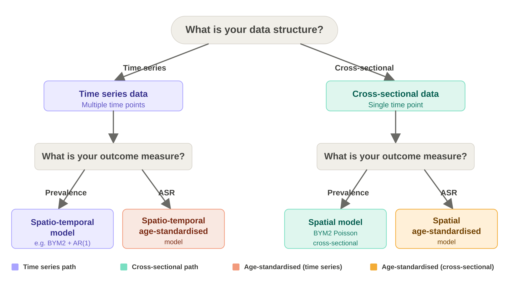

# BCC Spatial Smoothing App

Created by: [Chung Au-Yeung](https://github.com/ChungHim5d) </br>
Population Health Management</br>
Birmingham City Council

## Introduction

### What is Birmingham Spatial Smoothing App?

The Birmingham Spatial Smoothing App is a shiny app designed to support analysts at Birmingham City Council in producing **small-area health estimates** using Bayesian spatial smoothing models. 
The app aims to remove the need to write model code directly. Users can supply their own data set and shape file through a guided interface, and the app will fits the model based on user's decision. 
The app ultimately returns smoothed estimates and downloadable map visuals as a one-stop service. 

The underlying models are built on the Besag-York-Mollié 2 (BYM2) framework implemented via R-INLA, and account for spatial autocorrelation between neighbouring areas. It implies that 
areas with limited data or even no data borrow strengths from their neighbours rather than relying solely on local counts.


## Model Selection Guide

The app supports four model types depending on your data structure and outcome measure. Use the decision guide below to identify the right model before running the app.


### Decide the appropriate model following the below guidance

<div class="figure" style="text-align: center">


<p class="caption">
Model selection flowchart
</p>

</div>

## Installation & Setup
Please follow the [release page](https://github.com/BCC-PHM/BCC-Spatial-Smoothing-App-/releases/tag/v1.0) to download the latest release of the app. The requirements of using this 
app are listed in the same release page. 


## How to Use the App


### Step 1 — Prepare your data for different models accordingly
<br>

#### **A. Spatial model (cross-sectional, prevalence)**

Use this format when you have data for a single time point and want to model disease prevalence across the small area.

The data should contain **one row per small area**. Each row represents the number of observed cases and corresponding area id that will match you later supplied shape file.
It is optional of the data to contain population denominator because the app supports using built-in population at LSOA and ward levels. 

Required columns:

| Column | Description |
|---|---|
| `LSOA` | Lower Layer Super Output Area code. This is the small-area geographic identifier used for spatial modelling. |
| `count` | Number of observed cases in the LSOA. |

Optional columns:

| Column | Description |
|---|---|
| `DATASET` | Name or label of the health condition, indicator, or dataset being modelled. |
| `pop` | Population at risk in the LSOA. |

**Example data:**

| LSOA | DATASET | count | pop |
|---|---|---:|---:|
| E01033421 | Adults with hypertension | 14 | 312 |
| E01033422 | Adults with hypertension | 9 | 287 |
| E01033423 | Adults with hypertension | 21 | 401 |
| E01033424 | Adults with hypertension | 6 | 198 |
| E01033425 | Adults with hypertension | 17 | 356 |
| E01033426 | Adults with hypertension | 11 | 275 |
| E01033427 | Adults with hypertension | 3 | 143 |
| E01033428 | Adults with hypertension | 19 | 388 |

<br>

#### **B. Spatial age-standardised model (cross-sectional, ASR)**

Use this format when you have data for a single time point and want to model age-standardised rates across the small areas.

Before running the age-standardised model, convert your single age column into the **required age groups**. The following code can be copied and pasted to your data pre-processing scripts at your
convenience.


```r
age_levels = c(
  "UNDER 1", "1-4", "5-9", "10-14", "15-19", "20-24",
  "25-29", "30-34", "35-39", "40-44", "45-49", "50-54",
  "55-59", "60-64", "65-69", "70-74", "75-79", "80-84",
  "85-89", "90+"
)

df = df %>%
  mutate(
    AgeGroup = case_when(
      age < 1 ~ "UNDER 1",
      age >= 1 & age <= 4 ~ "1-4",
      age >= 5 & age <= 9 ~ "5-9",
      age >= 10 & age <= 14 ~ "10-14",
      age >= 15 & age <= 19 ~ "15-19",
      age >= 20 & age <= 24 ~ "20-24",
      age >= 25 & age <= 29 ~ "25-29",
      age >= 30 & age <= 34 ~ "30-34",
      age >= 35 & age <= 39 ~ "35-39",
      age >= 40 & age <= 44 ~ "40-44",
      age >= 45 & age <= 49 ~ "45-49",
      age >= 50 & age <= 54 ~ "50-54",
      age >= 55 & age <= 59 ~ "55-59",
      age >= 60 & age <= 64 ~ "60-64",
      age >= 65 & age <= 69 ~ "65-69",
      age >= 70 & age <= 74 ~ "70-74",
      age >= 75 & age <= 79 ~ "75-79",
      age >= 80 & age <= 84 ~ "80-84",
      age >= 85 & age <= 89 ~ "85-89",
      age >= 90 ~ "90+",
      TRUE ~ NA_character_
    ),
    AgeGroup = factor(AgeGroup, levels = age_levels)
  )
```

The data should contain **one row per age group per small area** when there is at least one observed count. 
You do not need to include age groups with zero counts; missing age groups will be handled later when the model input is prepared.

**Example data:**

| WARD code | AgeGroup | count |
|---|---|---:|
| E05001276 | 55-59 | 1 |
| E05001284 | 40-44 | 1 |
| E05001284 | 45-49 | 1 |
| E05001285 | 70-74 | 1 |
| E05001287 | 30-34 | 1 |
| E05001287 | 55-59 | 1 |
| E05001287 | 65-69 | 1 |
| E05001288 | 55-59 | 1 |


#### **C. Spatio-temporal model (time-series, prevalence)**
The app currently does not support


#### **D. Spatial-temporal-age-standardised model (time-series, ASR)**
The app currently does not support


### Step 2 — Upload your data

Prepare your input file (.csv or .xlsx) and **zipped shape file** and upload them to the appropriate upload spaces specified in the app. 

### Step 3 — Run the model
In the second upper tab of the app, you can specify the parameters of the models. However, unless you have very strong prior knowledge about 
the data, it is recommended to just run with the default settings. There is a **run analysis** button for you to click once you are happy with everything.
An interaticve message will pop up to indicate that the model is running while waiting for the results.
